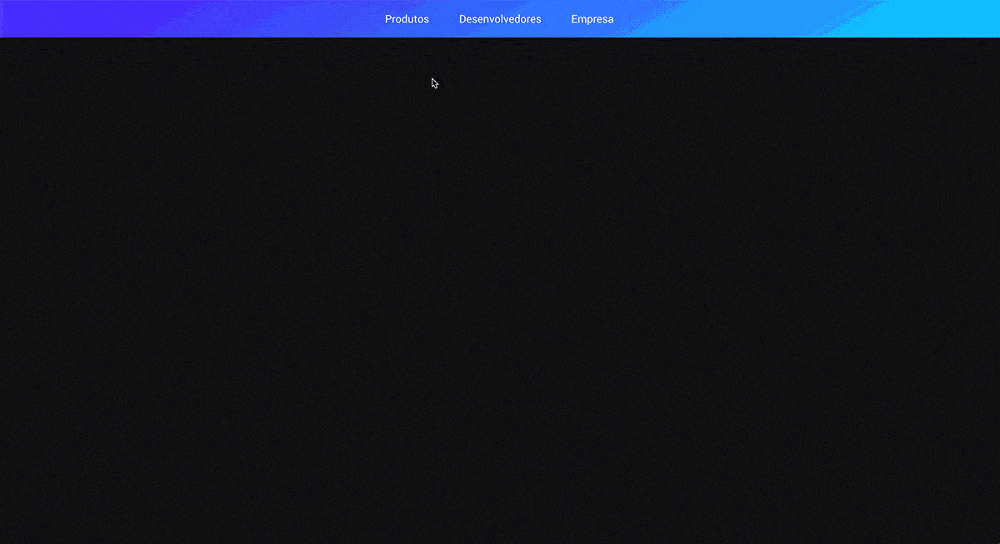

<h1 align="center">Stripe Menu Animation 👋</h1>

<p align="center">

</p>

## Índice

- [Índice](#índice)
- [🚀 Tecnologias utilizadas](#-tecnologias-utilizadas)
- [🗂 Como clonar o projeto](#-como-baixar-o-projeto)

## 🚀 Tecnologias utilizadas

- [Typescript](https://www.typescriptlang.org/)
- [React](https://reactjs.org/)
- [Styled Components](https://styled-components.com/)
- [Framer Motion](https://www.framer.com/api/motion/)
- [ESLint](https://eslint.org)
- [Prettier](https://prettier.io)

## 🗂 Como clonar o projeto

```bash

    # Clonar o repositório
    $ git clone https://github.com/mnzsss/stripe-menu-animation.git

    # Entrar no diretório
    $ cd ../stripe-menu-animation

    # Instalar Dependências
    $ yarn

    # Inicar projeto
    $ yarn start

```

---

<p align="center">
  Criado com ❤️ por Gabriel Menezes
</p>
